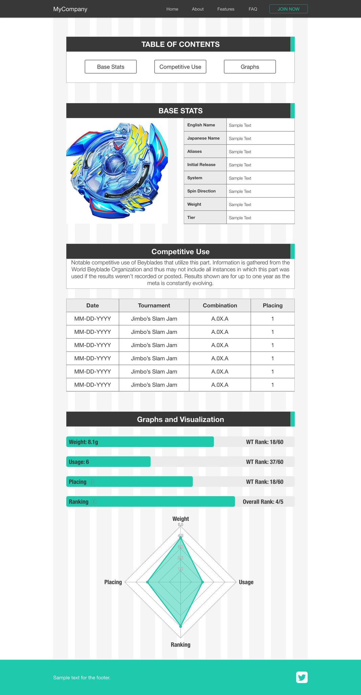

# README FOR THIS PROJECT
This is currently going to be a list of all parts for Beyblade Burst and an API to go with it.
What I want(ed) the site to look like:

# INFORMATION ABOUT THIS PROJECT

# SET UP

# CHANGE HISTORY
### 06/05/2019
* Home page added. It's very bare bones but I want the site to get started.
* Need to set up a way to test the API end points.
* Need serializers for the Part Model and the Combination Model.
* Added dual spin as an option when creating a part object.
* Adding functionality for signing up for, into and out of the site.

# TO-DO
* The Combination Model needs an overhaul from the admin panel side. When creating a new combination parts of all types come up for every specific part field. When creating a form to create combinations I can probably specify to only show specific types of parts in each drop down input.
* The Combination Model can't handle Gachinko layer combinations. This can be addressed once all other aspects of it are completed.
* Add cripsyforms or something so the sign up and sign in pages aren't so ugly.
* Make password resetting work.